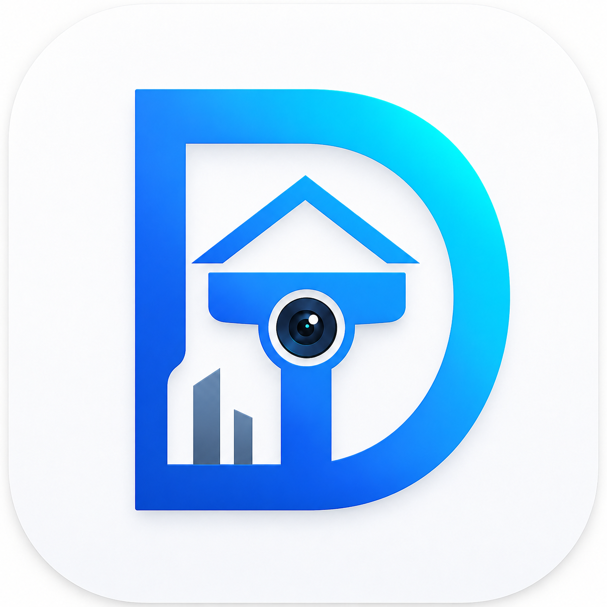

<p align="center">
  
</p>

<h1 align="center">DT Camera</h1>

<p align="center">
  🏠 A self-hosted camera surveillance system for live viewing, recording, playback, motion alerts, and storage management.
</p>

<p align="center">
  <strong>Go</strong> · <strong>React</strong> · <strong>PostgreSQL</strong> · <strong>ffmpeg</strong> · <strong>Docker Compose</strong>
</p>

<p align="center">
  🌟 <a href="https://github.com/duyltv/dt-camera">github.com/duyltv/dt-camera</a>
</p>

<p align="center">
  👤 <a href="http://fb.com/duyltv">Facebook</a> · 💼 <a href="https://www.linkedin.com/in/duyltv">LinkedIn</a>
</p>

---

## ✨ What Is This?

**DT Camera** is a Docker-based surveillance system designed for home, office, and small-site camera monitoring.

It supports:

- 📺 Live camera viewing with HLS
- 🎥 Background recording with ffmpeg
- 🕘 Playback by layout and timestamp
- 🧩 Custom camera layouts
- 🔐 Admin/user permissions
- 🚨 Motion detection alerts
- 📲 Telegram notification support
- 💾 Storage health and retention cleanup
- 🐳 One-command Docker Compose deployment

The goal is simple: a practical, self-hosted camera system that stays easy to run, easy to understand, and easy to improve.

## 🔎 Transparency And License

DT Camera is a **source-available, non-commercial project**.

The source code is public so everyone can inspect how the system works, review the logic, learn from it, and run it for a personal camera system at home or another small non-commercial setup.

✅ You may clone, run, study, modify, and use this project for personal or small non-commercial camera systems.

🚫 Commercial use is forbidden without permission. **Duy Nguyen (duyltv) owns all commercial rights to this codebase.** Using this project commercially without permission violates the owner's intellectual property rights.

This is **not MIT** and not an OSI-approved open-source license, because those licenses allow commercial use. See [LICENSE](LICENSE) for the full terms.

## 🧰 Requirements

You need:

- 🐳 Docker
- 🧱 Docker Compose
- 📷 RTSP or ONVIF-capable cameras
- 💽 A host folder for persisted recordings
- 🌐 A browser to use the web UI

No local Go, Node.js, PostgreSQL, or ffmpeg install is required for normal Docker usage.

## 🚀 Install

Clone the project:

```sh
git clone https://github.com/duyltv/dt-camera.git
cd dt-camera
```

Create your environment file:

```sh
cp .env.example .env
```

Open `.env` and set the first admin account:

```env
BOOTSTRAP_ADMIN_EMAIL=admin@example.com
BOOTSTRAP_ADMIN_PASSWORD=change-this-long-password
```

Start everything:

```sh
docker compose up -d --build
```

Open the app:

```text
http://localhost:8088
```

Sign in with the bootstrap admin account, then configure:

1. 💾 Storage
2. 📷 Cameras
3. 🧩 Layouts
4. 👥 Users and permissions
5. 🚨 Alerts and notifications

## 🌍 Using A Domain

Want to run DT Camera behind a real domain with HTTPS?

Read the dedicated guide:

➡️ [Domain And HTTPS Setup](docs/DOMAIN_SETUP.md)

## 📚 Documentation

Technical details live in `/docs` so the README stays friendly and easy to scan:

- 📖 [Documentation Home](docs/README.md)
- 🚀 [Getting Started](docs/GETTING_STARTED.md)
- 🧱 [Architecture](docs/ARCHITECTURE.md)
- ⚙️ [Configuration](docs/CONFIGURATION.md)
- 🛠️ [API Reference](docs/API_REFERENCE.md)
- 🌍 [Domain And HTTPS Setup](docs/DOMAIN_SETUP.md)
- 🧯 [Operations Guide](docs/OPERATIONS.md)
- ❓ [FAQ](docs/FAQ.md)
- 🔐 [Security, Privacy, And Legal Notes](docs/SECURITY_PRIVACY_LEGAL.md)
- ⚙️ [.env.example](.env.example)

## 🗂️ Project Stack

- 🧠 **Backend:** Golang
- 🎛️ **Frontend:** React + Vite
- 🗄️ **Database:** PostgreSQL
- 🎞️ **Recording worker:** Golang + ffmpeg
- 📡 **Live streaming:** HLS
- 🐳 **Runtime:** Docker Compose

## 🤝 Support The Project

If DT Camera is useful to you, please support the project:

- ⭐ Give the repository a **Star** on GitHub
- 🔁 Share it with anyone building a self-hosted camera system
- 💖 Donations are welcome at [paypal.me/duyltv](https://paypal.me/duyltv)

Every star and share helps the project grow. Thank you! 🙏

## 👤 Credits

Created and maintained by **Duy Nguyen (duyltv)**.

- 🌐 GitHub: [duyltv/dt-camera](https://github.com/duyltv/dt-camera)
- 👥 Facebook: [fb.com/duyltv](http://fb.com/duyltv)
- 💼 LinkedIn: [linkedin.com/in/duyltv](https://www.linkedin.com/in/duyltv)

Built for people who want a camera system they can own, inspect, and run themselves. 🔐
